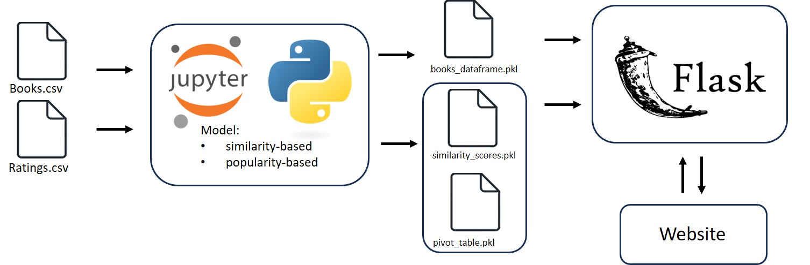

## ML Project: Book Recommendation System

This repository contains the code for a book recommendation system built using classical recommendation algorithms. The system is designed to take a book title as input and return a list of recommended books based on patterns learned from a static dataset (collaborative filtering). The recommended books are presented together with their average rating and number of reviews from the relevant portion of the dataset (popularity based recommendation). Finally, the user can get recommendations by interacting with a website connected to a Flask API.

### Overview

This project demonstrates a basic implementation of a book recommendation system without relying on a live database for book additions or real-time updates. The model is built using a specific dataset (originally sourced from [Kaggle Book Recommendation Dataset](https://www.kaggle.com/datasets/arashnic/book-recommendation-dataset?select=Ratings.csv)) and provides recommendations based on the learned relationships between books and user ratings.

The system uses a **collaborative filtering technique** (developed in Jupyter Notebook) to compute similarity scores between books. These scores are stored in `similarity_scores.pkl` file and used together with `pivot_table.pkl` for generating recommendations. In addition to this, the project has been enriched with **popularity-based features**. Specifically:

- The `books_dataframe.pkl` file contains **average ratings** and **number of reviews** for each book title.
- These values were calculated using only the titles present in the pivot table to ensure alignment with the recommendation model.
- The **website UI displays** these popularity metrics alongside the recommended titles, offering more insight to users.

This makes the system a **hybrid of similarity-based and popularity-based recommendations.**

### Repository Structure

- **`app.py`**: A Flask application that exposes an API endpoint (`/recommend`) to receive a book title and return recommendations. Implements fuzzy search and "Did you mean?" functionality.
- **`pivot_table.pkl`**: Pre-computed pivoted user-book ratings.
- **`similarity_scores.pkl`**: Pre-computed book similarity matrix.
- **`books_dataframe.pkl`**: Contains book metadata including average rating and number of reviews.
- **`requirements.txt`**: Python libraries required to run the app.
- **`website/`**: Simple HTML/CSS/JS front-end for user interaction.
  - `index.html`: Main webpage with input and results.
  - `style.css`: Basic styling.
  - `script.js`: Sends API requests, handles results and suggestions.
- **`README.md`**: This file.
- **`research/`**: Jupyter Notebook for data exploration and model training.
  - `notebook.ipynb`: Contains data prep, model training, and export logic.

### Architecture



1. Jupyter Notebook is used for data exploration, similarity computation, and generating the `.pkl` files.
2. Flask serves the `/recommend` API endpoint and loads the `.pkl` files.
3. A website front-end communicates with the Flask API.
4. Recommendations include similarity-based results along with average rating and review count.

### Setup

1. **Clone the repository:**

   ```bash
   git clone https://github.com/Milanomac/book-recommendation-ml-project.git
   cd [path_to_repository]
   ```

2. **Create a virtual environment (Recommended):**

   - Using conda:

     ```bash
     conda create -n venv python=3.10
     conda activate venv
     ```

3. **Install requirements:**

   ```bash
   pip install -r requirements.txt
   ```

4. **Ensure required `.pkl` files are present** in the root directory:

   - `pivot_table.pkl`
   - `similarity_scores.pkl`
   - `books_dataframe.pkl`

### Running the Application

**Running the Flask API (Backend):**

1.  Open a terminal in the root directory of the repository.
2.  Run the Flask application:

    ```bash
    python app.py
    ```

    This will start the Flask development server (usually on `http://127.0.0.1:5000/`).

**Running the Simple Website (Frontend):**

1.  Open the `website/index.html` file in your web browser.

**Using the Recommendation System:**

1.  Ensure the Flask API is running in your terminal.
2.  In your web browser, in the "Book Recommendation" webpage, enter the title of a book you'd like recommendations for in the input field.
3.  Click the "Get Recommendations" button.
4.  The recommended books (or "Did you mean?" suggestions) will be displayed below with the avg ratings and rating counts.

**Alternatively, you can directly interact with the API using tools like `curl` or Postman:**

```bash
curl -X POST -H "Content-Type: application/json" -d '{"book_name": "Animal Farm"}' [http://127.0.0.1:5000/recommend](http://127.0.0.1:5000/recommend)
```
